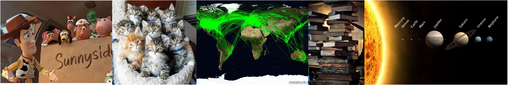

**We've just collected some data! Now let's explore it!** 

In this short exercise you will create exploratory data visualizations using the data we just collected, by:

1. uncommenting lines of code (remove `#` signs) 
2. completing the code blanks (`___`)

Remember you do not need to **commit** or **push** your work! Just complete the code and **Knit** to save your changes and update the html output.

The goal of this exercise is to become more comfortable using the `ggplot()` function.

### Packages

We will need the `ggplot2` package, which is contained in the `tidyverse`.

```{r load-libraries, message = FALSE}
# library(___)
```


### Data

Next let's load the class data. Look for the `.csv` file in the current `e-03a-class-poll` folder:

```{r load-data}
# poll_data <- read.csv("___")
```

Let's take a look at the dimensions (rows and columns), and variables (column names):

```{r}
# glimpse(___)
```


### Data Dictionary

The dataframe contains `___` observations and `___` columns. Complete the data dictionary below.

The variables are:

  - `moves` : number of times a student has moved home 
  - `pets` : number of pets owned
  - `flights` : number of international flights traveled
  - `credits` : number of UIC credit hours enrolled in Fall 2021
  - ___ : ___   


### Exploratory Plots

So far you have seen scatter plots created using the `geom_point()` function. However, scatter plots are unlikely to be informative for these survey data because the questions are unrelated. 

You will instead need to use the `geom_histogram()` function, which uses one aesthetic mapping to the x-axis to create a frequency plot (histogram) of the data.

#### Plot 1: House moves

Complete the code chunk below to plot a simple histogram of the number of house moves:

```{r plot-q1, message = FALSE}
# ggplot(data = poll_data, aes(x = ___)) +
#   geom_histogram() 
```

#### Plot 2: Pets owned

Complete the code chunk below to plot a histogram of the number of pets owned, **and this time add an informative title and axis labels using **`labs()`.

```{r plot-q2, message = FALSE}
# ggplot(data = poll_data, aes(x = ___)) +
#   geom_histogram() +
#   labs(title = "Number of Pets Owned by EAES 494 Students",
#        x = "___",
#        y = "Count")
```

#### Plot 3: International flights traveled

Complete the code chunk below to plot a histogram of the number of international flights traveled:

```{r plot-q3, message = FALSE}
# ggplot(data = ___, aes(x = ___)) +
#   geom_histogram() +
#   labs(title = "___",
#        x = "___",
#        y = "___")
```


#### Plot 4: Credit-hours enrollment

Complete the code chunk below to plot a histogram of the number of credit hours enrolled in **and this time clean up the look of the plot by adding the theme layer named** `theme_bw()`

```{r plot-q4, message = FALSE}
# ggplot(data = ___, aes(x = ___)) +
#   geom_histogram() +
#   labs(title = "___",
#        x = "___",
#        y = "___") 
```


#### Plot 5: Estimate of the number of moons in our solar system

Complete the code chunk below to plot a histogram of the student-estimated number of moons in our solar system, **and this time add a theme layer of your choice (from list that appears as you start to type `theme`)**.

```{r plot-q5, message = FALSE}
# ggplot(data = ___, aes(x = ___)) +
#   geom_histogram() +
#   labs(title = "___",
#        x = "___",
#        y = "___") 
```

